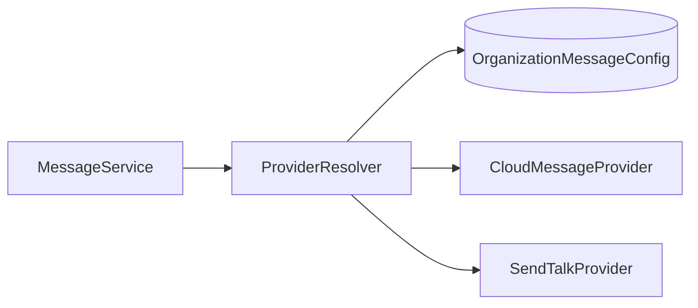
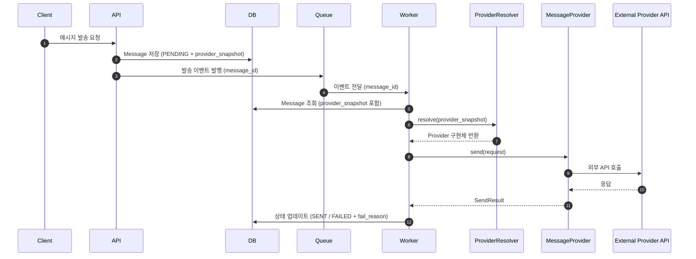

# 📌 Multi-Tenant Message Provider Architecture Design

> 사전 설계 과제 제출 문서  
> 작성자: 윤지완  
> 작성일: 2026-03-01  

본 문서는 기존 단일 메시지 전송 업체 구조를  
조직(테넌트) 단위로 서로 다른 메시지 전송 업체를 사용할 수 있도록 확장하기 위한 설계 문서이다.

본 설계는 단순 기능 추가가 아닌,  
멀티테넌트 환경에서 외부 의존성을 안전하게 분리하는 것을 핵심 목표로 한다.

---

## 📑 Table of Contents

- [Part A. 서버 설계](#part-a-서버-설계)
  - [1️⃣ 요구사항 분석 및 가정 정의](#1️⃣-요구사항-분석-및-가정-정의)
  - [2️⃣ 데이터 모델 확장](#2️⃣-데이터-모델-확장)
  - [3️⃣ Provider 추상화 구조 도입](#3️⃣-provider-추상화-구조-도입)
  - [4️⃣ 발송 파이프라인 비동기화](#4️⃣-발송-파이프라인-비동기화)
  - [A-2. 기술적 결정 사항](#a-2-기술적-결정-사항)
  - [A-3. 리스크 및 대응](#a-3-리스크-및-대응)
- [Part B. 화면 설계](#part-b-화면-설계)
- [AI 활용 내역](#ai-활용-내역)
- [최종 요약](#최종-요약)

---

# Part A. 서버 설계

---

## 1️⃣ 요구사항 분석 및 가정 정의

### 🎯 목표
- 조직별 메시지 업체 분리
- 업체 변경 시 발송 일관성 보장
- 보안 강화 및 장애 격리

### 📌 가정
- 한 조직은 하나의 ACTIVE 업체만 사용
- 각 조직은 외부 업체 계정을 별도로 보유
- 메시지 발송은 외부 HTTP API 호출 기반
- 발송 내역은 DB 저장
- 대량 트래픽 가능성 존재
- org_id는 JWT 기반으로 서버에서 강제 추출

---

## 2️⃣ 데이터 모델 확장

### 📌 OrganizationMessageConfig

| 컬럼명 | 타입 | 설명 |
|--------|------|------|
| id | PK | 설정 ID |
| org_id | FK | 조직 ID |
| provider_type | ENUM | CLOUD_MESSAGE / SEND_TALK |
| status | ENUM | DRAFT / ACTIVE |
| credentials_enc | TEXT | 암호화된 API Key/Secret |
| version | INT | 낙관적 락 |
| updated_at | DATETIME | 수정 시각 |
| updated_by | USER_ID | 수정자 |

### 🔎 설계 의도
- DRAFT → TEST → ACTIVE 구조로 운영 실수 방지
- Secret 암호화 저장
- 낙관적 락으로 동시 수정 방지

---

### 📌 Message 테이블 변경

| 컬럼명 | 타입 | 설명 |
|--------|------|------|
| id | PK | 메시지 ID |
| org_id | FK | 조직 ID |
| provider_snapshot | ENUM | 생성 시점 업체 |
| status | ENUM | PENDING / SENT / FAILED |
| fail_reason | TEXT | 실패 사유 |

### 🔎 provider_snapshot 설계 이유

- 메시지 생성 시점에 ACTIVE provider 저장
- 재시도/비동기 처리 시 snapshot 기준으로 Provider 선택
- 업체 변경 후에도 기존 메시지는 동일 업체로 발송 보장

---

## 3️⃣ Provider 추상화 구조 도입

### ❌ 기존 방식 (if-else 분기)
- OCP 위반
- 유지보수성 저하
- 테스트 분리 어려움

### ✅ 전략 패턴 적용

```kotlin
interface MessageProvider {
    fun send(request: MessageRequest): SendResult
}

class CloudMessageProvider : MessageProvider
class SendTalkProvider : MessageProvider

val provider = providerResolver.resolve(orgId)
provider.send(request)
```

### 🔎 ProviderResolver의 역할

- JWT 기반 org_id 추출
- OrganizationMessageConfig에서 ACTIVE 설정 조회
- provider_type 기반 Provider 구현체 반환
- Secret 복호화 처리

---

### 📊 Provider 책임 분리 구조



- Service → 발송 흐름 관리
- Resolver → 멀티테넌트 분기
- Provider → 업체별 구현

---

## 4️⃣ 발송 파이프라인 비동기화

### 🎯 동기 방식의 문제점

- 외부 API 지연 → 사용자 응답 지연
- 대량 발송 시 트래픽 스파이크
- 외부 장애가 내부 장애로 전이

### ✅ 비동기 구조 선택 이유

- 장애 격리
- 재시도 전략 적용
- DLQ 처리 가능
- Worker 수평 확장 가능

---

## 📊 비동기 메시지 발송 시퀀스



---

## A-2. 기술적 결정 사항

| 항목 | 선택 | 근거 |
|------|------|------|
| 업체 분기 | Provider 추상화 | 확장성 확보 |
| 발송 처리 | 비동기 큐 | 장애 격리 |
| 설정 반영 | DRAFT → TEST → ACTIVE | 운영 실수 방지 |
| 변경 일관성 | provider_snapshot | 재시도 안정성 |

---

## A-3. 리스크 및 대응

| 위험 요소 | 영향 | 완화 전략 |
|------------|------|------------|
| 외부 API 장애 | SLA 위반 | 타임아웃 + 재시도 + DLQ |
| 관리자 오입력 | 발송 중단 | TEST 필수화 |
| 테넌트 침해 | 과금/법적 문제 | JWT 기반 org 검증 |
| Secret 유출 | 비용 손실 | 암호화 + 마스킹 |
| 동시 수정 | 설정 충돌 | Optimistic Lock |

---

# Part B. 화면 설계

## 화면 흐름

1. 설정 화면 진입 (조직명 / 현재 ACTIVE 표시)
2. 업체 선택
3. API Key / Secret 입력
4. 저장 (DRAFT)
5. 연결 테스트
6. 활성화 (ACTIVE)

---

## UI 결정 사항

| 항목 | 선택 | 이유 |
|------|------|------|
| 저장/활성화 분리 | 분리 | 운영 실수 방지 |
| 테스트 필수화 | 성공 후 활성화 | 안정성 확보 |
| Secret 표시 | 마스킹 + 재조회 불가 | 보안 강화 |
| 조직 정보 강조 | 상단 고정 | 테넌트 실수 방지 |

---

## 예외 / 엣지 케이스

| 상황 | UI 대응 |
|------|----------|
| 필수값 누락 | 인라인 에러 |
| 테스트 실패 | 실패 사유 명확 표시 |
| 외부 장애 | 재시도 안내 |
| 동시 수정 | 충돌 메시지 |
| 업체 변경 | "신규 메시지부터 적용" 안내 |

---

# AI 활용 내역

### 사용 목적
- 멀티테넌트 설계 구조 검토
- 전략 패턴 구조 정제
- 외부 API 장애 대응 전략 도출
- Mermaid 다이어그램 생성

### 활용 의도
설계 대안 비교 및 리스크 도출 과정에서 AI를 참고하였으며,  
최종 설계 선택은 요구사항과 운영 안정성을 기준으로 판단하였다.

---

# ✅ 최종 요약

본 설계는 단순 업체 추가가 아닌,

- 멀티테넌트 분리
- 발송 일관성 보장
- 장애 격리
- 보안 강화
- 확장 가능한 구조

를 동시에 달성하기 위한 아키텍처 설계이다.

신규 업체 추가 시 기존 코드 수정 없이  
Provider 구현체 추가만으로 확장 가능하다.
